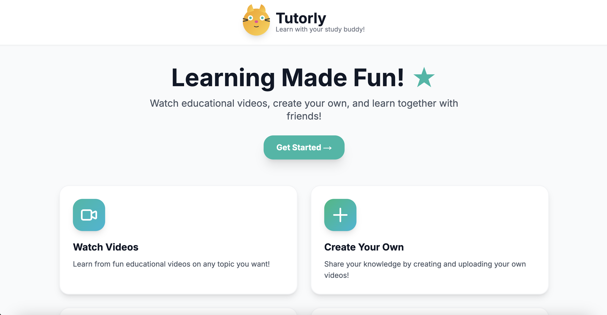
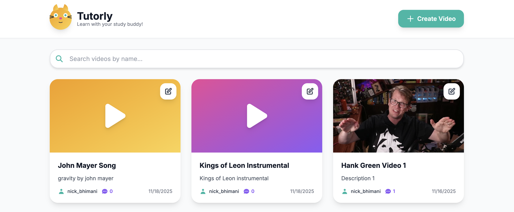
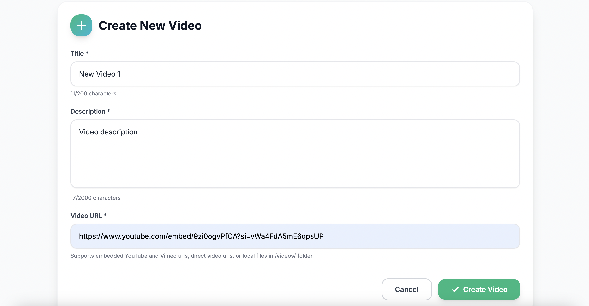

# Educational Video Player

A modern web application for creating, watching, and commenting on educational videos. Built with Next.js, React, TypeScript, and Tailwind CSS.

## Features

- **Splash Page**: Welcome page describing platform features
- **Video List**: Search and select from a collection of educational videos
- **Create Videos**: Add new videos with title, description, and video URL
- **Edit Videos**: Update video title and description
- **Comments**: View and post comments on videos
- **Full-Featured Player**: 
  - Full screen playback
  - Playback speed control (0.5x - 2x)
  - Volume control
  - Progress bar with seek functionality
  - Play/pause controls
- **Security & Validation**: 
  - Input length limits for all user inputs
  - Profanity filtering on titles, descriptions, and comments
  - Duplicate title detection
  - URL validation for video sources
- **Accessibility**: WCAG compliant with semantic HTML, ARIA attributes, keyboard navigation, and screen reader support

## Demo

Watch a video demonstration of the application: [Loom Demo Video](https://www.loom.com/share/997f518590344e779c26e260d9cf19b7)

## Screenshots

### Landing Page


### Video List


### Video Player


### Create Video Dialog


## Technology Stack

- **Framework**: Next.js 14 (App Router)
- **Language**: TypeScript
- **Styling**: Tailwind CSS
- **UI**: Custom components with modern design

## Getting Started

### Prerequisites

- Node.js 18+ and npm/yarn

### Installation

1. Install dependencies:
```bash
npm install
```

2. Configure environment variables (optional):
   - Create a `.env` file in the root directory
   - Add: `NEXT_PUBLIC_API_URL=https://take-home-assessment-423502.uc.r.appspot.com/api` (if different from default)
   - Add: `NEXT_PUBLIC_USER_ID=your_user_id` (user ID in snake_case format, e.g., `john_smith`)
     - Default: `first_last` if not specified
   - Add: `NEXT_PUBLIC_LOG_LEVEL=error` (options: `error`, `warn`, `info`, `debug`)
     - `error` (default): Only errors are logged
     - `warn`: Errors and warnings
     - `info`: Errors, warnings, and info messages
     - `debug`: All logs including debug messages

3. Run the development server:
```bash
npm run dev
```

4. Open [http://localhost:3000](http://localhost:3000) in your browser


### User ID Format

- For creating videos: Configure via `NEXT_PUBLIC_USER_ID` environment variable in snake_case format (e.g., `john_smith`)
  - Defaults to `nick_bhimani` if not specified
- For comments: User ID is randomly generated

## Project Structure

```
├── app/
│   ├── layout.tsx          # Root layout
│   ├── page.tsx            # Splash page
│   ├── videos/
│   │   └── page.tsx        # Main videos page
│   └── globals.css         # Global styles
├── components/
│   ├── VideoList.tsx       # Video list component
│   ├── VideoPlayer.tsx     # Video player with controls
│   ├── CreateVideoForm.tsx # Video creation form
│   ├── EditVideoForm.tsx   # Video editing form
│   ├── CommentsSection.tsx # Comments display and form
│   ├── Logo.tsx            # Animated logo component
│   └── SplashPage.tsx      # Splash page component
├── lib/
│   ├── api.ts              # API service layer
│   ├── logger.ts           # Configurable logging utility
│   ├── validation.ts       # Input validation utilities
│   └── videoUtils.ts       # Video URL analysis utilities
├── types/
│   └── index.ts            # TypeScript type definitions
└── package.json
```

## Features in Detail

### Splash Page
- Welcome page accessible at the root route (`/`)
- Describes platform features and capabilities
- Kid-friendly design matching the main application

### Video Player
- Responsive video player with custom controls
- Full screen support
- Playback speed: 0.5x, 0.75x, 1x, 1.25x, 1.5x, 2x
- Volume control with visual feedback
- Progress bar with seek functionality
- Auto-hiding controls on hover
- Supports YouTube, Vimeo embeds, and direct video files

### Video Management
- Create videos with title, description, and URL
- Edit existing video titles and descriptions
- View all videos in a responsive grid layout with thumbnails
- Search videos by name
- Click any video to watch and comment

### Comments System
- View all comments for a video
- Post new comments
- Real-time comment updates
- User identification display

### Security Features
- **Input Validation**: All user inputs are validated for length limits:
  - Title: max 200 characters
  - Description: max 2000 characters
  - Comments: max 1000 characters
  - URLs: max 2048 characters
- **Profanity Filtering**: Content filtering on titles, descriptions, and comments using a hardcoded word list. In production, this would be replaced with a dedicated profanity filtering library or API service.
- **Duplicate Detection**: Prevents creating videos with duplicate titles (case-insensitive)
- **URL Validation**: Validates video URLs to ensure they use supported protocols (HTTP/HTTPS) and formats

### Accessibility (WCAG Compliance)
- Semantic HTML structure for proper document outline
- ARIA labels and roles for screen reader support
- Keyboard navigation support throughout the application
- Skip links for main content
- Focus management and visible focus indicators
- Alt text and descriptive labels for interactive elements
- Color contrast meets WCAG AA standards

## Development

The application uses:
- **Next.js App Router** for routing and server components
- **TypeScript** for type safety
- **Tailwind CSS** for styling
- **React Hooks** for state management
